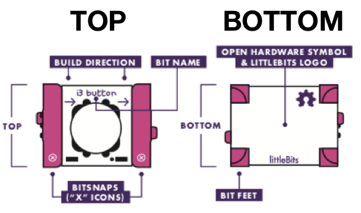
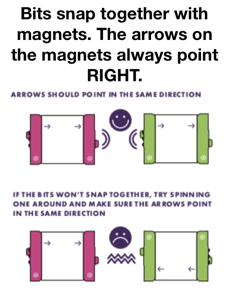
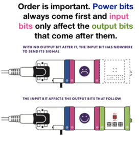

### Cybersecurity First Principles in this lesson
* __Modularity__: The concept of modularity is like building blocks. Each block (or module) can be put in or taken out from a bigger project. Each module has its own separate function that is interchangeable with other modules.Each littleBit has it’s own specific function and you can change out Bits to make different inventions.
* __Abstraction__: An abstraction is a representation of an object or concept. It could be something such as a door, a speedometer, or a data structure in computer science. Abstraction decouples the design from the implementation. The gauges in an automobile are an abstraction of the performance of a car. A map is an abstraction of the earth. When you connect multiple littleBits together, you create an invention that solves a problem. Summarizing what your invention does is an abstraction of all the parts in the invention. 
* __Resource Encapsulation__: Encapsulation is an object oriented concept where all data and functions required to use the resource are packaged into a single self-contained component. The goal is to only allow access or manipulation of the resource in the way the designer intended. An example, assume a flag pole is the object. There are fixed methods on how the flag pole is to be used. Put the flag on, take the flag off, raise or lower the flag. Nothing else can be done to the flag pole.
* __Simplicity__: Simplicity allows a person to better understand hardware and software. Without the clutter of unnecessarily complicated code and interfaces, the software will be more understandable by people that will update the code when requirements change. It will be easier to understand by the testers and they will be able to spot problems sooner. By keeping software as simple and as focused as possible, the reliability and security is greatly increased.

### Introduction
#### What are littlebits?
* Each littleBit is an electronic circuit or switch, and it has its own unique function.
* Each littleBit snaps together using magnets and are connected in a sequence, to make a circuit.
* Developed by Ayah Bdeir while working on her Master’s degree in Computing Culture at MIT. She created the first littleBits prototypes on her own in 2011.

### Goals
1. Understand modularity.
2. Know how littleBits work.

### Materials Required]
* [Intro to LittleBits Presentation](./assets/presentation.pdf) 
* [Student Handout](./assets/student-handout.pdf)
* Various LittleBits components

### Prerequisite Lessons
None

### Table of Contents
<!-- TOC -->
- [Cybersecurity First Principles in this lesson](#cybersecurity-first-principles-in-this-lesson)
- [Introduction](#introduction)
  - [What are littlebits?](#what-are-littlebits)
- [Goals](#goals)
- [Materials Required]](#materials-required)
- [Prerequisite Lessons](#prerequisite-lessons)
- [Table of Contents](#table-of-contents)
- [Basics of littleBits](#basics-of-littlebits)
  - [Challenges](#challenges)
- [Evaluation](#evaluation)
- [Additional Resources](#additional-resources)
- [Lead Author](#lead-author)
- [Acknowledgements](#acknowledgements)
- [License](#license)

<!-- /TOC -->

### Basics of littleBits
LittleBits are grouped into four different categories:

* **Pink** modules are _inputs_, like an On/Off button. Input Bits accept input from you or the environment and send signals that affect the Bits that follow.  
* **Green** modules are _outputs_, like LEDs and Fans.  
* **Orange** modules are special and usually are _supportive_. They allow you to wire your bits up, connect to other systems, and perform unique advanced functions.  
* **Blue** modules are power related. They provide your circuits with the power they need to operate.  
* Bits snap together with magnets. The arrows on the magnets always go RIGHT.
* Order is important. `Power` bits always come first and input bits only affect the output bits that come after them.

> Credit: LittleBits (https://littlebits.com/)  
> 

> Credit: LittleBits (https://littlebits.com/)  
> 

> Credit: LittleBits (https://littlebits.com/)  

#### Challenges
* **Challenge 1:** You suspect that your sibling has been breaking into your room and snooping around in your stuff, but you never seem to catch them in the act. You decide to create a littleBit Invention that will alert you the next time your sibling is in your room.
* **Challenge 2:** Get alerted if your refrigerator door has been left open for too long! The FDA says that your fridge should be set between 38 and 40 degrees Fahrenheit. If the temperature rises above this temperature for an extended period of time, your food could go bad. Prevent this from happening by creating a invention littleBits smart fridge circuit so you can save your food!

### Lead Author
Kristeen Shabram

### Acknowledgements
Thanks to Raeanne Sando and Matt Hale for editting this module. 

### License
Overall content: Copyright (C) 2017-2019  [Dr. Matthew L. Hale](http://faculty.ist.unomaha.edu/mhale/), [Dr. Robin Gandhi](http://faculty.ist.unomaha.edu/rgandhi/), and [Dr. Briana B. Morrison](http://www.brianamorrison.net).

Lesson content: Copyright (C) Kristeen Shabram 2019.  
 This lesson is licensed by the author under a <a rel="license" href="http://creativecommons.org/licenses/by-nc-sa/4.0/">Creative Commons Attribution-NonCommercial-ShareAlike 4.0 International License</a>.
