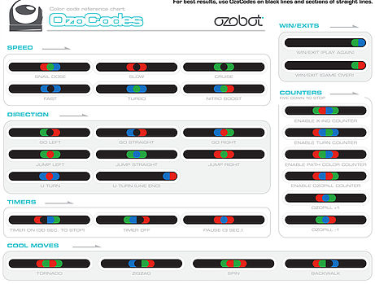

### Cybersecurity First Principles in this lesson
* __Abstraction__: An abstraction is a representation of an object or concept. It could be something such as a door, a speedometer, or a data structure in computer science. Abstraction decouples the design from the implementation. The gauges in an automobile are an abstraction of the performance of a car. A map is an abstraction of the earth.
* __Modularization__: The concept of modularity is like building blocks. Each block (or module) can be put in or taken out from a bigger project. Each module has its own separate function that is interchangeable with other modules.
* __Resource Encapsulation__: Encapsulation is an object oriented concept where all data and functions required to use the resource are packaged into a single self-contained component. The goal is to only allow access or manipulation of the resource in the way the designer intended. An example, assume a flag pole is the object. There are fixed methods on how the flag pole is to be used. Put the flag on, take the flag off, raise or lower the flag. Nothing else can be done to the flag pole. 

### Introduction
Street signs give pedestrians and drivers important information while on the road. Similarly, color codes are what the Ozobot understands and follows. In this lesson, you will learn about color codes as a means of programming the Ozobot to follow the pathways you want it to, just like a driver follows road signs.

### Goals
* Identify and understand the codes that the Ozobot understands.
* Apply understanding of the Ozobot codes by completing at least 2 challenges.

### Materials Required
* Ozobot and markers
* [Ozobot Color Codes](assets/README-8deead7d.pdf)
* [Ozobot Presentation](assets/README-58b6d1d7.pdf)
* [Ozobot Student Handouts](assets/README-fa36f670.pdf)

### Prerequisite Lessons
None, just lots of curiosity

### Table of Contents

### Getting started with color codes
Color codes are like roadsigns. They tell the Ozobot how to drive. The chart below shows you some of the road signs your Ozobot will obey (if it sees them).

> Credit: Ozobot, https://thekaleidoscope.org/wp-content/uploads/2017/04/OzoCodes.jpg

### Challenges
* Create a track in the shape of a quadrilateral. It must contain 3 left turns and a spin.
* Create a track in a shape that includes at least 2 right angles.
* Write your name and add different codes along the way.
* Design a roller coaster track for Ozobot to ride on. Add codes to increase her speed as she goes down the roller coaster.
* Design your own Ozobot challenge.
* Create a dance move for Ozobot using at least 3 color codes.
* Design a map for your Ozobot to get from one place to another. Label your map.
* Team up with a partner and have one Ozobot start a track and then bump into a second Ozobot to finish the track.
* Create a maze and then draw the path for your Ozobot to follow in order to successfully travel through the maze.

### Lead Author
Lynn Spady

### Acknowledgements
Thanks to Matt Hale for editing these lesson materials.

### License
[Nebraska GenCyber](https://www.nebraskagencyber.com)   is licensed under a <a rel="license" href="http://creativecommons.org/licenses/by-nc-sa/4.0/">Creative Commons Attribution-NonCommercial-ShareAlike 4.0 International License</a>.

Overall content: Copyright (C) 2017-2019  [Dr. Matthew L. Hale](http://faculty.ist.unomaha.edu/mhale/), [Dr. Robin Gandhi](http://faculty.ist.unomaha.edu/rgandhi/), and [Dr. Briana B. Morrison](http://www.brianamorrison.net).

Lesson content: Copyright (C) Lynn Spady 2019.  
 This lesson is licensed by the author under a <a rel="license" href="http://creativecommons.org/licenses/by-nc-sa/4.0/">Creative Commons Attribution-NonCommercial-ShareAlike 4.0 International License</a>.
