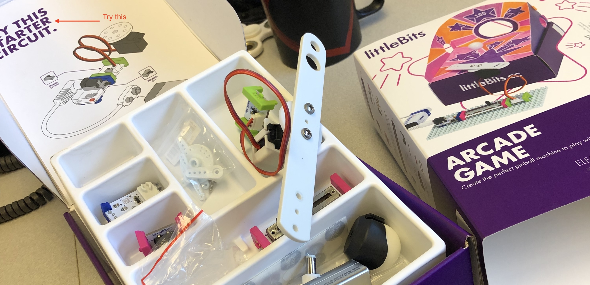
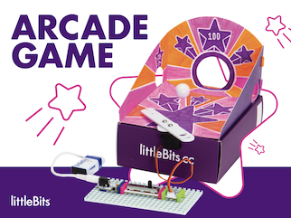
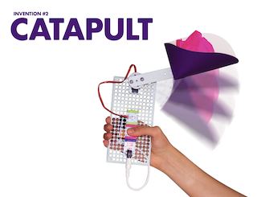
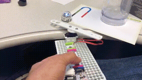

# Building Arcade Games with Littlebits

### Cybersecurity First Principles in this lesson

* __Abstraction__: An abstraction is a representation of an object or concept. It could be something such as a door, a speedometer, or a data structure in computer science. Abstraction decouples the design from the implementation. The gauges in an automobile are an abstraction of the performance of a car. A map is an abstraction of the earth.

* __Modularization__: The concept of modularity is like building blocks. Each block (or module) can be put in or taken out from a bigger project. Each module has its own separate function that is interchangeable with other modules.

* __Simplicity__: Simplicity allows a person to better understand hardware and software. Without the clutter of unnecessarily complicated code and interfaces, the software will be more understandable by people that will update the code when requirements change. It will be easier to understand by the testers and they will be able to spot problems sooner. By keeping software as simple and as focused as possible, the reliability and security is greatly increased.

### Introduction
In this lesson, we will explore a cool hands-on activity with Littlebits to build an arcade game. Littlebits follows a _component-based design_ paradigm using _GPIO_ (or general purpose input/output) to let you easily make different inventions. We will learn how to plug and play bits together to make some simple inventions. Littlebits is one the key components in your final Rube Goldberg machine. Inventions developed in this module will add a layer to your machine.

### Goals
1. Student will be able to use **Littlebits** to make a functional arcade game.
2. Student will be able to understand funciontal modularity.
3. Student will be able to come up with their own arcade ideas, refine them and iteratively improve their designs.

### Materials Required

* [Littlebits arcade kit](https://littlebits.com/products/arcade-game)
* Power outlet nearby

### Prerequisite lessons
* [Introduction to Computational Thinking and Design Process](https://mlhale.github.io/nebraska-gencyber-modules/intro_to_computational_thinking_and_design_process/README/)
* [Introduction to Components With Littlebits](https://mlhale.github.io/nebraska-gencyber-modules/intro_to_components_with_littlebits/README/)

### Table of Contents
<!-- TOC START min:1 max:3 link:true update:true -->
- [Hands-on IoT with - Littlebits Intro](#hands-on-iot-with---littlebits-intro)
    - [Cybersecurity First Principles in this lesson](#cybersecurity-first-principles-in-this-lesson)
    - [Introduction](#introduction)
    - [Goals](#goals)
    - [Materials Required](#materials-required)
    - [Prerequisite lessons](#prerequisite-lessons)
    - [Table of Contents](#table-of-contents)
    - [Step 1: Unbox it!](#step-1-unbox-it)
    - [Step 2: Gotta start somewhere](#step-2-gotta-start-somewhere)
    - [Step 3: Count all the things!](#step-3-count-all-the-things)
    - [Step 4: The world is more than True or False - Variable Inputs](#step-4-the-world-is-more-than-true-or-false---variable-inputs)
    - [Step 5: Hey, Listen - Audio](#step-5-hey-listen---audio)
    - [Step 6: Turning on an outlet with the IR transmitter](#step-6-turning-on-an-outlet-with-the-ir-transmitter)
    - [Step 7: Motoring onward](#step-7-motoring-onward)
    - [Self Exploration](#self-exploration)
    - [Test Your Bits, err... Wits!](#test-your-bits-err-wits)
    - [Additional Resources](#additional-resources)
    - [Acknowledgements](#acknowledgements)
    - [License](#license)

<!-- TOC END -->

### Step 1: Unbox it!
First, open your Littlebits Arcade Game box. Take a second to look at the different components you have.

A quick reminder, Littlebits is organized around three colors:

* **<span style="color: pink">Pink</span>** modules are _inputs_, like an On/Off button or a Slide Dimmer.
* **<span style="color: green">Green</span>** modules are _outputs_, like LEDs, Fans and Servo Motors.
* **<span style="color: orange">Orange</span>** modules are special and usually are _supportive_ - think splitters and logic handlers. The arcade game kit does not have a module of this kind, but we have several of these available in the camp library.
* **<span style="color: blue">Blue</span>** modules are power related.

Look over each module.



### Step 2: Gotta start somewhere
No time like the present. Lets make a simple invention. Your box should include a helpful "TRY THIS STARTER CIRCUIT" diagram. Try and build it!

* find the blue ```power``` module.
* find the 9V ```battery```
* find the white ```cable``` that connects the ```battery```to the ```power``` module
* find the green ```servo``` output module

Lets make a simple circuit:

* Connect the ```battery```to the ```power``` module with the white ```cable``
* Connect the green ```servo``` module to the ```power``` module
* Set the ```mode``` to ```swing``` on the ```servo``` module
* Move the switch to the ```on``` position on the ```power``` module
* The ```servo``` should swing back and forth


That was easy!

This is `GPIO` in a nutshell. Each module has a general purpose input and output, with a standard interface, and **doesn't need to understand or know anything about what they are connected to**. These modules also need to protect themselves from invalid input. For example, try and connect the wrong side of the servo module of the power module. The magnetic polarity of Littlebits should stop you from doing so. This is a great example of the `modularity` cybersecurity first principle.

### Step 3: Pinball Hall of Fame!
Ok, we've made our first circuit - but it's pretty simple. Let's add some more modules and make a pinball arcade game:

[Follow the instructions linked here to build the game.](./files/pinball-instructions.pdf)

[](./files/pinball-instructions.pdf)


### Step 4: Let's get ready to....Catapult

What can be more fun than making your own pinball machine? I know... a launcher for crumpled paper balls! Turns out, with a few modification, we can repurpose the materials used in the pinball machine to make a Catapult.

Whatever you do don't let the teacher catch you launching these ;-)

[Follow these instruction to build one of these.](./files/catapult-instructions.pdf)

[](./files/catapult-instructions.pdf)

### Self Exploration
Seems like you got a hang of this! Now think of an invention that would nudge an Ozobot on to the next stage of your Rube Goldberg machine. Use the iterative design process to build some prototypes and then refine them.

Here is something simple that I tested:



### Additional Resources
- [Food for thought: [Video] Littlebits meets Ozobot](https://www.youtube.com/watch?v=2uUBTV7fL_U)

### Lead Author

- Robin Gandhi

### Acknowledgements
Special thanks to Dr. Matt Hale for reviewing and editing this lesson.

### License
[Nebraska GenCyber](https://github.com/MLHale/nebraska-gencyber) <a rel="license" href="http://creativecommons.org/licenses/by-nc-sa/4.0/"></a><br /> is licensed under a <a rel="license" href="http://creativecommons.org/licenses/by-nc-sa/4.0/">Creative Commons Attribution-NonCommercial-ShareAlike 4.0 International License</a>.

Overall content: Copyright (C) 2017-2018  [Dr. Matthew L. Hale](http://faculty.ist.unomaha.edu/mhale/), [Dr. Robin Gandhi](http://faculty.ist.unomaha.edu/rgandhi/), and [Doug Rausch](http://www.bellevue.edu/about/leadership/faculty/rausch-douglas).

Lesson content: Copyright (C) [Dr. Matthew L. Hale](http://faculty.ist.unomaha.edu/mhale/) 2017-2018.  
<a rel="license" href="http://creativecommons.org/licenses/by-nc-sa/4.0/"></a><br /><span xmlns:dct="http://purl.org/dc/terms/" property="dct:title">This lesson</span> is licensed by the author under a <a rel="license" href="http://creativecommons.org/licenses/by-nc-sa/4.0/">Creative Commons Attribution-NonCommercial-ShareAlike 4.0 International License</a>.
