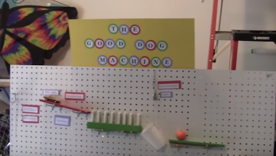
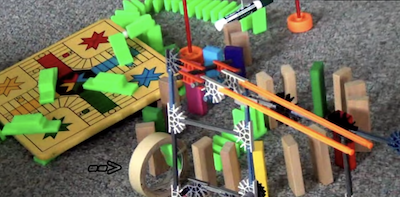

### Cybersecurity First Principles in this lesson
* __Abstraction__: An abstraction is a representation of an object or concept. It could be something such as a door, a speedometer, or a data structure in computer science. Abstraction decouples the design from the implementation. The gauges in an automobile are an abstraction of the performance of a car. A map is an abstraction of the earth.

* __Layering__: Cyber security uses multiple layers of defense or protecting information. If one layer is defeated the next layer should catch it.

* __Minimization__: Minimization refers to having the least functionality necessary in a program or device. The goal of minimization is to simplify and decrease the number of ways that software can be exploited. This can include **turning off ports that are not needed**, reducing the amount of code running on a machine, and/or turning off unneeded features in an application.

* __Modularization__: The concept of modularity is like building blocks. Each block (or module) can be put in or taken out from a bigger project. Each module has its own separate function that is interchangeable with other modules.

* __Resource Encapsulation__: Encapsulation is an object oriented concept where all data and functions required to use the resource are packaged into a single self-contained component. The goal is to only allow access or manipulation of the resource in the way the designer intended. An example, assume a flag pole is the object. There are fixed methods on how the flag pole is to be used. Put the flag on, take the flag off, raise or lower the flag. Nothing else can be done to the flag pole.

* __Simplicity__: Simplicity allows a person to better understand hardware and software. Without the clutter of unnecessarily complicated code and interfaces, the software will be more understandable by people that will update the code when requirements change. It will be easier to understand by the testers and they will be able to spot problems sooner. By keeping software as simple and as focused as possible, the reliability and security is greatly increased.

### Introduction
In this lesson, we will learn the basics of Rube Goldberg machines and construct a simple one with basic supplies. Emphasis is place on using the computational thinking and design process methodology in the scope of simple machines to solve basic problems. We will be building a Rube Goldberg over the duration of camp, so this is an introduction to the concepts you will use later.

### Goals
* Identify what a Rube Goldberg machine is 
* Apply design thinking to build an abstraction of a Rube Goldberg
* Construct a Rube Goldberg using the abstraction as a reference guide

### Materials Required
* paper
* glue 
* tape
* dominoes 
* other basic supplies (e.g. marbles)

### Prerequisite Lessons
* [Introduction to Computational Thinking and Design Process](../introduction_to_computational_thinking_and_design_process/README.md)

### Table of Contents
<!-- TOC -->

- [Cybersecurity First Principles in this lesson](#cybersecurity-first-principles-in-this-lesson)
- [Introduction](#introduction)
- [Goals](#goals)
- [Materials Required](#materials-required)
- [Prerequisite Lessons](#prerequisite-lessons)
- [Table of Contents](#table-of-contents)
- [What is Rube Goldberg](#what-is-rube-goldberg)
- [Challenge](#challenge)
- [License](#license)

<!-- /TOC -->
### What is Rube Goldberg 
A `rube goldberg` machine is a device that accomplishes a task by complex means when it can seemingly be done more simply. It is actually a great example of how **NOT** to build a secure system. They don't make use of __simplicity__ or __minimization__, which are two important principles of system design. That said, Rube Goldberg machines are FUN to build! They are also a useful tool for illustrating computational thinking and design process. Finally, when done well, Rube Goldbergs make great use of __abstraction__, __modularization__, and __resource encapsulation__.

Lets watch an intro video to see some Rube Goldbergs in action.
* [Intro Video](https://www.youtube.com/watch?v=3rjLPX-LcB8)

* [Intro video 2](https://youtu.be/xHrYypDKXTc)

> See this [video of all of the times it didn't work](https://www.youtube.com/watch?v=7bMbgW32wfA)
### Challenge
Create a machine that `takes the trash out` (AKA drops a piece of trash into a cup). 

* Use your GenCyber workbook to document a model __abstraction__ of your design. Use the `draw out your initial design` section. Like the girls in the video, try to plan out what concepts will work together to make your design work. 
* How will you test your design? Write down your `test criteria` in the workbook and what your expectations are.
* After you have planned it out, build it. 
* Did it work as expected? What were the results of your test criteria?
* Draw out a `refined design` using what you've learned so far. 
* Build it and test it

### License
[Nebraska GenCyber](https://www.nebraskagencyber.com)   is licensed under a <a rel="license" href="http://creativecommons.org/licenses/by-nc-sa/4.0/">Creative Commons Attribution-NonCommercial-ShareAlike 4.0 International License</a>.

Overall content: Copyright (C) 2017-2019  [Dr. Matthew L. Hale](http://faculty.ist.unomaha.edu/mhale/), [Dr. Robin Gandhi](http://faculty.ist.unomaha.edu/rgandhi/), and [Dr. Briana B. Morrison](http://www.brianamorrison.net).

Lesson content: Copyright (C) [Dr. Matthew L. Hale](http://faculty.ist.unomaha.edu/mhale/) 2019.  
 This lesson is licensed by the author under a <a rel="license" href="http://creativecommons.org/licenses/by-nc-sa/4.0/">Creative Commons Attribution-NonCommercial-ShareAlike 4.0 International License</a>.
